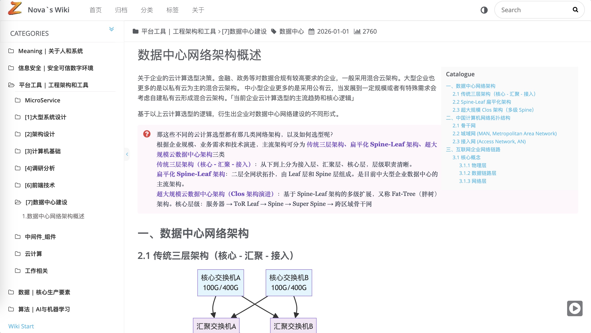
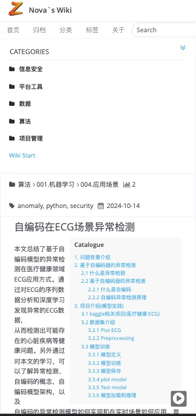

<div align="center">

# 📚 hexo-theme-Quinoa

<p align="center">
  <a href="https://waisec.cn/" target="_blank">
    
  </a>
</p>

<p align="center">
  <a href="./README.md">🇺🇸 English</a> •
  <a href="https://waisec.cn/">🌐 在线演示</a> •
  <a href="#-快速开始">🚀 快速开始</a> •
  <a href="#-特性">✨ 特性</a>
</p>

<p align="center">
  
  
  
</p>

> **一款现代化的 Hexo 主题，专为个人知识管理和文档站点设计。**
> 
> 为追求清晰结构和无缝导航的思考者、写作者和知识构建者而生。

</div>

---

## ✨ 特性

### 🧭 双模式路由系统
- **全站模式 (SPA)**: 基于 Hash 的导航，平滑过渡，侧边栏导航，完整的 Wiki 体验。通过 `?fullpage=1` 参数访问
- **单页模式 (独立页面)**: 无需参数的干净分享页面 - 适合外部链接和嵌入
- **无缝切换**: 在两种模式间即时切换，不丢失上下文

### 📖 知识优先设计
- **层级分类**: 侧边栏多级分类树，支持展开/折叠
- **全文搜索**: 基于 Insight Search 的闪电般客户端搜索
- **Wiki 风格导航**: 专为相互关联的知识库设计，而非普通博客

### 📱 响应式与移动优化
- **移动优先**: 可折叠侧边栏，触摸友好的界面
- **自适应布局**: 跨设备优化的阅读体验
- **智能工具栏**: 为移动用户提供上下文感知操作

### 🎨 现代美学
- **清晰排版**: 为长文阅读优化
- **代码高亮**: 多主题语法高亮
- **图片画廊**: 内置灯箱和自适应画廊
- **暗黑模式就绪**: 易于自定义配色方案

### 🔧 开发者友好
- **版本控制集成**: 每篇文章的 GitHub/GitLab 历史追踪
- **插件生态**: MathJax、Mermaid 图表、音乐播放器、加密文章
- **SEO 优化**: 站点地图、RSS 订阅、Open Graph 元标签
- **分析就绪**: Google Analytics、百度统计、不蒜子访客统计

### 🤖 AI 就绪架构
- **Markdown 原生**: 完美适配 AI 内容生成和处理
- **静态站点**: AI 爬虫易于索引，便于构建知识库
- **Git 工作流**: AI 可参与内容审核和版本控制
- **数据主权**: 完全拥有你的知识数据

---

## 🆚 Quinoa vs Notion

> **为什么选择 Quinoa 而非 Notion？** 以下是对比：

| 特性 | **Quinoa** | **Notion** |
|------|------------|------------|
| **数据所有权** | ✅ 完全控制 (Git 管理) | ⚠️ 托管在 Notion 服务器 |
| **AI 友好** | ✅ Markdown 原生，静态 HTML | ⚠️ 专有格式 |
| **SEO** | ✅ 搜索引擎优化 | ⚠️ SEO 能力有限 |
| **嵌入能力** | ✅ 干净的独立页面 (默认) | ⚠️ 带品牌标识的嵌入 |
| **成本** | ✅ 免费 (仅需域名+服务器) | 💰 高级功能付费 |
| **离线访问** | ✅ 完整静态文件 | ⚠️ 需要缓存 |
| **实时协作** | ❌ Git 工作流 | ✅ 多人实时编辑 |
| **数据库** | ❌ 基于文件 | ✅ 内置数据库 |

**选择 Quinoa：** 当你需要完全的数据控制、AI 就绪的内容、SEO 优化，以及能够在任何地方嵌入干净页面时。

**选择 Notion：** 当你需要实时协作和内置数据库功能时。

---

## 🚀 快速开始

### 环境要求
- **Hexo**: v3.6 或更高版本
- **Node.js**: 推荐 v18+
- **npm**: 推荐 v10+

### 安装步骤

```bash
# 1. 进入你的 Hexo 站点目录
cd your-hexo-site

# 2. 克隆主题
git clone https://github.com/quanoc/hexo-theme-Quinoa.git themes/Quinoa

# 3. 复制必要的模板文件
cp -rf themes/Quinoa/_source/* source/
cp -rf themes/Quinoa/_scaffolds/* scaffolds/

# 4. 创建主题配置文件
cp themes/Quinoa/_config.yml.example themes/Quinoa/_config.yml

# 5. 安装所需插件
npm install --save hexo-autonofollow hexo-directory-category hexo-generator-feed hexo-generator-json-content hexo-generator-sitemap hexo-abbrlink hexo-permalink-pinyin
```

### 启用主题

编辑站点的 `_config.yml`：

```yaml
theme: Quinoa
```

### 开始写作

```bash
hexo new "我的知识文章"
hexo server
```

---

## ⚙️ 配置说明

### 站点配置 (`_config.yml`)

```yaml
# URL 结构 (Wiki 风格永久链接)
# 选项 1：短链接 (推荐) - 简洁、易分享的 URL
permalink: wiki/:abbrlink/

# 选项 2：短链接 + 拼音 (可读) - 适合中文内容
# permalink: wiki/:abbrlink/:pinyin_title/

# 选项 3：基于标题 (原始) - 可能包含中文字符
# permalink: wiki/:title/"

# 跳过渲染特殊文件
skip_render:
  - README.md
  - '_posts/**/embed_page/**'

# 写作设置
new_post_name: :title.md

# Markdown 渲染
marked:
  gfm: true

# 搜索配置
jsonContent:
  meta: false
  pages:
    title: true
    date: true
    path: true
    text: true
  posts:
    title: true
    date: true
    path: true
    text: true
    tags: true
    categories: true
  ignore:
    - 404.html

# SEO
sitemap:
  path: sitemap.xml

nofollow:
  enable: true
  exclude:
    - your-domain.com

# 短链接配置 (需要 hexo-abbrlink)
abbrlink:
  alg: crc32      # 算法: crc16 (默认) 或 crc32
  rep: hex        # 格式: hex (默认) 或 dec
  drafts: false   # 是否处理草稿

# 拼音 URL 配置 (需要 hexo-permalink-pinyin)
# 自动为中文标题生成拼音 slug
permalink_pinyin:
  enable: true
  separator: '-'     # 拼音词之间的分隔符
  lowercase: true    # 转为小写
  transform: title   # 转换标题为拼音
  # 提示：如需精简拼音（如 rhsy-hexo），可在 front-matter 手动指定 slug：
  # ---
  # title: 如何使用 Hexo
  # slug: rhsy-hexo
  # ---
```

### 主题配置 (`themes/Quinoa/_config.yml`)

> ⚠️ **重要**: 请将个人信息替换为你自己的！

```yaml
# 自定义站点标识
customize:
    sidebar: left              # 侧边栏位置: left | right
    category_perExpand: false  # 自动展开分类
    default_index_file: index.md  # 使用特定页面作为首页
    
    # 社交链接
    social_links:
        github: https://github.com/yourname
        rss: /atom.xml

# 挂件 (侧边栏组件)
widgets:
    - category
    # - recent_posts
    # - archive
    # - tag
    # - tagcloud
    # - links

# Git 版本控制集成
history_control:
    enable: true
    server_link: https://github.com
    user: <你的-github-用户名>
    repertory: <你的仓库名>
    branch: master

# 搜索
search:
    insight: true    # 需要 hexo-generator-json-content
    
# 分析
plugins:
    busuanzi_count: true    # 访客统计
    google_analytics:       # GA 跟踪 ID
    baidu_analytics:        # 百度统计 ID
```

---

## 🖼️ 截图展示

<div align="center">

| 桌面端视图 | 移动端视图 |
|:----------:|:----------:|
|  |  |

</div>

---

## 📚 文档

### 核心概念

| 特性 | 描述 |
|------|------|
| **SPA 路由** | 通过 `?fullpage=1` 访问基于 Hash 的导航，无需页面刷新即可无缝浏览 |
| **独立模式** | 无需参数的干净分享页面 - 适合外部链接 |
| **分类树** | 层级化组织，侧边栏可展开导航 |
| **全文搜索** | 即时搜索所有内容 |

### 写作技巧

1. **用分类组织**: 使用目录结构实现自动分类
2. **自由链接**: 内部链接在 SPA 和独立模式下都能无缝工作
3. **嵌入媒体**: 支持图片、视频、代码块和交互式图表
4. **版本控制**: 启用 `history_control` 通过 Git 追踪变更

### 🤖 AI Agent 应用场景

Quinoa 的架构非常适合 AI 驱动的工作流：

#### 1. **AI 知识库构建器**
```bash
# 工作流：AI 辅助文档编写
AI 生成内容 → Markdown 文件 → Git 提交 → Hexo 构建 → Quinoa 部署
```
- 使用 ChatGPT/Claude 生成技术文档
- 使用 Git 进行版本控制
- 通过 CI/CD 流水线自动部署

#### 2. **RAG (检索增强生成) 知识源**
- 静态 HTML 页面易于 AI 爬取
- 从 Quinoa 站点构建向量数据库
- 作为 AI 助手的知识来源

#### 3. **AI 聊天机器人集成**
```html
<!-- 在 AI 聊天界面中嵌入干净独立页面 -->
<iframe src="https://your-wiki.com/article/"></iframe>
```
- 单页模式为 AI Agent 提供上下文
- 无导航干扰，便于 AI 解析

#### 4. **自动化内容流水线**
```yaml
# 示例：GitHub Actions + AI
1. AI 监控代码变更
2. 自动生成文档
3. 创建 Pull Request
4. 合并 → 自动部署到 Quinoa 站点
```

#### 5. **个人 AI 第二大脑**
- 用 Markdown 编写笔记 (AI 友好)
- 使用分类进行层级化组织
- 全文搜索实现快速检索
- Git 历史追踪思路演变

---

## 🔄 更新主题

```bash
cd themes/Quinoa
git pull origin master
```

---

## 🤝 贡献

欢迎贡献！请随时提交 Issue 或 Pull Request。

---

## 📄 许可证

本项目采用 [MIT 许可证](./LICENSE)。

---

<div align="center">

**用 ❤️ 为知识构建者打造**

[⬆ 返回顶部](#-hexo-theme-quinoa)

</div>
